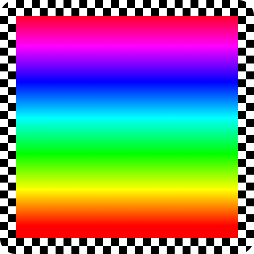
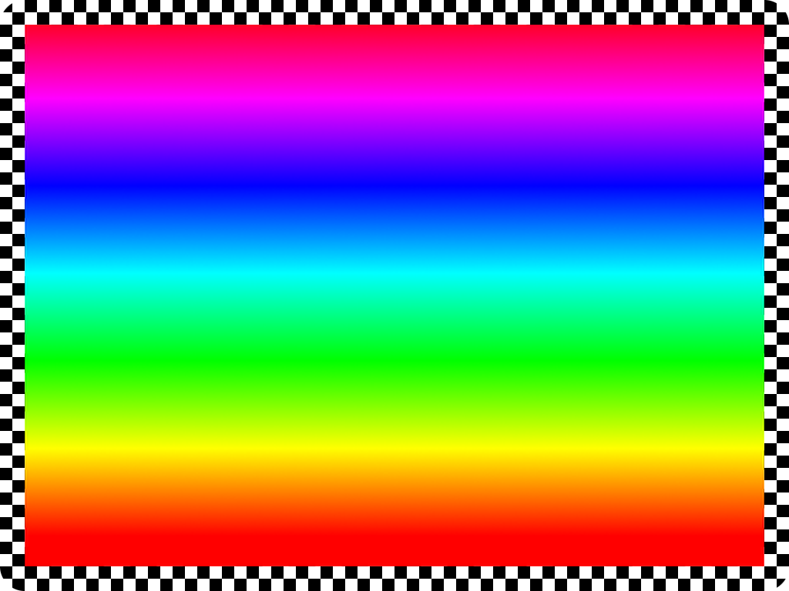
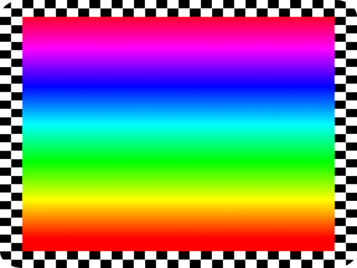

# nine-slice

**Scale images using [nine-slice scaling](https://en.wikipedia.org/wiki/9-slice_scaling).**

Nine-slice scaling is a common rendering technique used to scale images without distorting its borders.

**Source:**



**With `nine-slice`:**



**With standard scaling:**



## Example usage

```rust
use fast_image_resize::{images::Image, PixelType};
use nine_slice::*;

// Define offsets from the edges of the source image.
let offsets = BorderOffsets {
    left: 16,
    top: 16,
    right: 16,
    bottom: 16,
};

// Load a raw bitmap.
// For png and jpg files, enable their respective feature flags.
let src = include_bytes!("../test_files/src/example.raw").to_vec();
// Three channels, one byte per channel (RGB8).
let pixel_type = PixelType::U8x3;
// Convert to an Image.
let image = Image::from_vec_u8(64, 64, src, pixel_type).unwrap();
// Slice the image.
let mut sprite = NineSlicedSprite::new(image, offsets, BorderScaling::Repeat).unwrap();

// Create a resized image.
let _ = sprite.resize(1024, 768).unwrap();
```

## Feature flags

- `png` to add read/write functions for .png files
- `jpg` to add read/write functions for .jpg files

## Pixel Types

`nine-slice` can slice images with the following pixel types:

| Pixel type         | Slice | Read/write png | Read/write jpg |
|--------------------|-------|----------------|----------------|
| `PixelType::U8`    | Yes   | Yes            | Yes            |
| `PixelType::U8x2`  | Yes   | Yes            | No             |
| `PixelType::U8x3`  | Yes   | Yes            | Yes            |
| `PixelType::U8x4`  | Yes   | Yes            | No             |
| `PixelType::U16`   | No    | No             | No             |
| `PixelType::U16x2` | No    | No             | No             |
| `PixelType::U16x3` | No    | No             | No             |
| `PixelType::U16x4` | No    | No             | No             |
| `PixelType::I32`   | No    | No             | No             |
| `PixelType::F32`   | Yes   | No             | No             |
| `PixelType::F32x2` | No    | No             | No             |
| `PixelType::F32x3` | Yes   | No             | No             |
| `PixelType::F32x4` | Yes   | No             | No             |

## How it works

100% genuine software rendering. `nine-slice` just does a lot of copy+pasting and resizing with in-memory raw bitmaps. Want to use a GPU instead? Try Bevy.

## Speed

Run `cargo bench --all-features` and find out.

- By default, `BorderScaling::Stretch` and `BorderScaling::Repeat` are approximately the same speed.
- When using `BorderScaling::Stretch`, you can set the resizing algorithm by calling `sprite.set_resize_algorithm(resize_algorithm)`. The default algorithm yields the highest quality but the worst performance. `ResizeAlg::Nearest` is the worst quality and best performance.
- When using `BorderScaling::Stretch`, if a non-corner slice of the sprite is entirely one color, `nine-slice` will just set the output image's pixels to the appropriate color, rather than running any resize algorithm at all. This is faster than `ResizeAlg::Nearest` and it's on a per-slice basis. For example, if the top slice is a solid color and the other slices aren't, the top slice will be filled and every other slice will be resized and pasted onto the output image. 